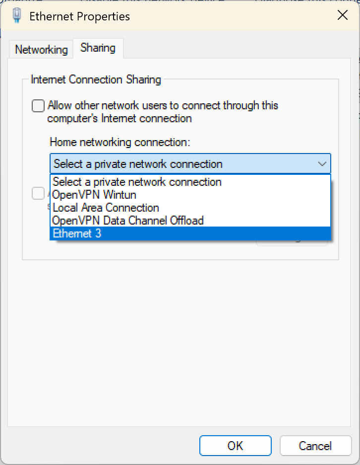

* What the project is
* Folder map (pi_runtime/firmware/tools/tests)
* How to run on the Pi for now
Note that systemd deploy lives under deploy/systemd

## Project Description
Github repo containing code for the Condorcam Tower.

## Repo Structure
Pico firmware:
> firmware\pico\

Pi runtime scripts:
> pi_runtime\

Test scripts:
> tests\scripts\

Updater and log downloader scripts:
> tools\updater\

Python libraries required for operation:
> requirements.txt

## Setup Instructions
Clone repo:
> git clone https://github.com/peytonearly/condorcam-tower
> cd condorcam-tower/deploy
> chmod +x bootstrap_pi.sh install_service.sh
> ./bootstrap_pi.sh
> ./install_service.sh

## Updating Process (Windows)
*NOTE: Process likely to change in the future*
1. Press `Windows + R`, then enter `ncpa.cpl`. This will open the network connections panel.
2. Identify the network adapter that is connected to the internet. Right-click this adapter and select `Properties`.
3. In the window that pops up, navigate to the `Sharing` tab. Use the dropdown to select the adapter that is connected to the system, and check the box above.

4. Open a command prompt/powershell window. Enter `ping raspberrypi.local` to ensure the Raspberry Pi is accessible (i.e. returning pings).
5. Enter `ssh pi@raspberrpi.local` to connect to the Pi. Password is `admin`.
    - If this is the first time connecting to the Pi from this computer, it will ask you to save a fingerprint. Enter `Yes`.
6. Once connected to the Pi, you'll need to set a temporary network configuration to allow the Pi to connect to the internet through your shared network (set up previously in step 3).\
*This implementation will likely change in the future, but is required for now*.\
Enter the following commands, in this order:
    1. `sudo ip addr add 192.168.137.2/24 dev eth0`
    2. `sudo ip route add default via 192.168.137.1 dev eth0`
    3. `echo "nameserver 8.8.8.8" | sudo tee /etc/resolv.conf > /dev/null`
    4. Verify proper connection to the internet with `ping google.com`. If the ping is returned, the connection is solid.
7. Enter `cd condorcam-tower`.
8. Enter `git pull` to grab the latest version.
9. Reboot the system to restart the script, or enter the command `sudo systemctl restart condorcam.service` to restart the script without rebooting.