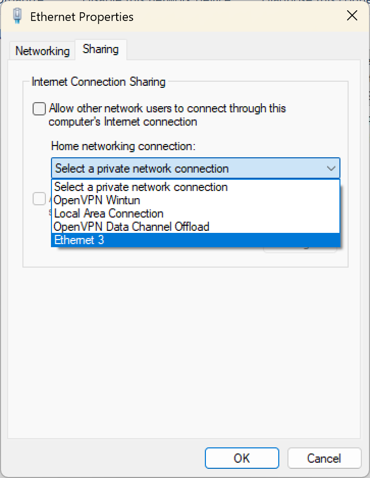

* What the project is
* Folder map (pi_runtime/firmware/tools/tests)
* How to run on the Pi for now
Note that systemd deploy lives under deploy/systemd

## Project Description
Github repo containing code for the Condorcam Tower.

## Repo Structure
Pico firmware:
> firmware\pico\

Pi runtime scripts:
> pi_runtime\

Test scripts:
> tests\scripts\

Updater and log downloader scripts:
> tools\updater\

Python libraries required for operation:
> requirements.txt

## Setup Instructions
Clone repo:
> git clone https://github.com/peytonearly/condorcam-tower
> cd condorcam-tower/deploy
> chmod +x bootstrap_pi.sh install_service.sh
> ./bootstrap_pi.sh
> ./install_service.sh

## Updating Process (Windows)
*NOTE: Process likely to change in the future*
1. Press `Windows + R`, then enter `ncpa.cpl`. This will open the network connections panel.
2. Identify the network adapter that is connected to the internet. Right-click this adapter and select `Properties`.
3. In the window that pops up, navigate to the `Sharing` tab. Use the dropdown to select the adapter that is connected to the system, and check the box above. (If no dropdown, might be that there is only one other adapter to use. Can proceed.)

4. Open a command prompt/powershell window. Enter `ping raspberrypi.local` to ensure the Raspberry Pi is accessible (i.e. returning pings).
5. Enter `ssh pi@raspberrypi.local` to connect to the Pi. Password is `admin`.
    - If this is the first time connecting to the Pi from this computer, it will ask you to confirm the connection. Enter `yes`.
6. Enter `cd condorcam-tower`.
7. Enter `git pull` to grab the latest version.
8. Reboot the system to restart the script, or enter the command `sudo systemctl restart condorcam.service` to restart the script without rebooting.